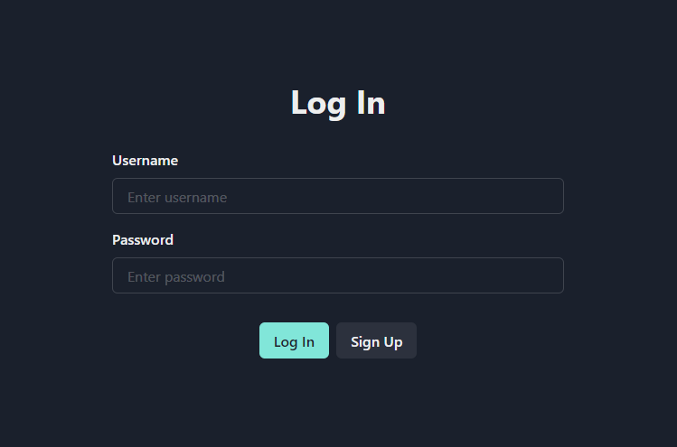
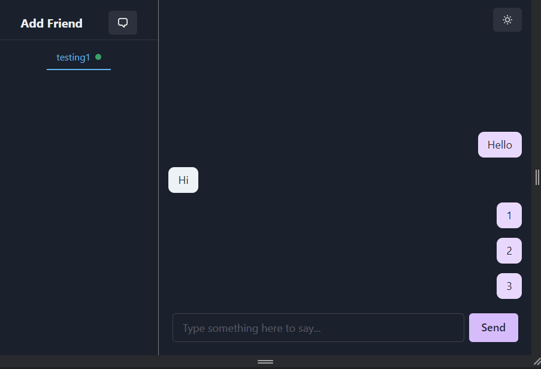
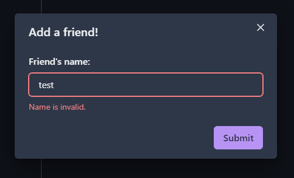
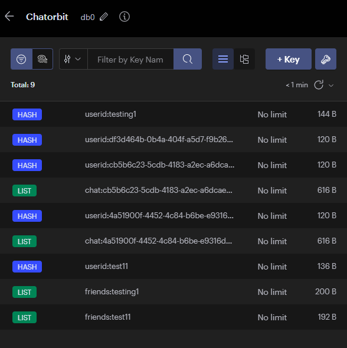

ChatOrbit
================

General Info
------------
> ChatOrbit is a full-stack chat application. 
> Using: NodeJS, ReactJS, Express, PostgreSQL, Redis, Websockets, Authentication, Validators, ChakraUI

### Features
* POST, GET AND PUT requests for -Login, Sign up, Add a friend, Send a message, change online status-
* SQL Database system using PostgreSQL.
* Storing chats and online status in memory using Redis.
* Socket.io to simultaneously update every client when a message is sent and online status changes.
* Responsive Design for both Web and Mobile

### Screenshots

> Login Page    
> Chatting     
> Add A Friend     
> Storing in Redis     
